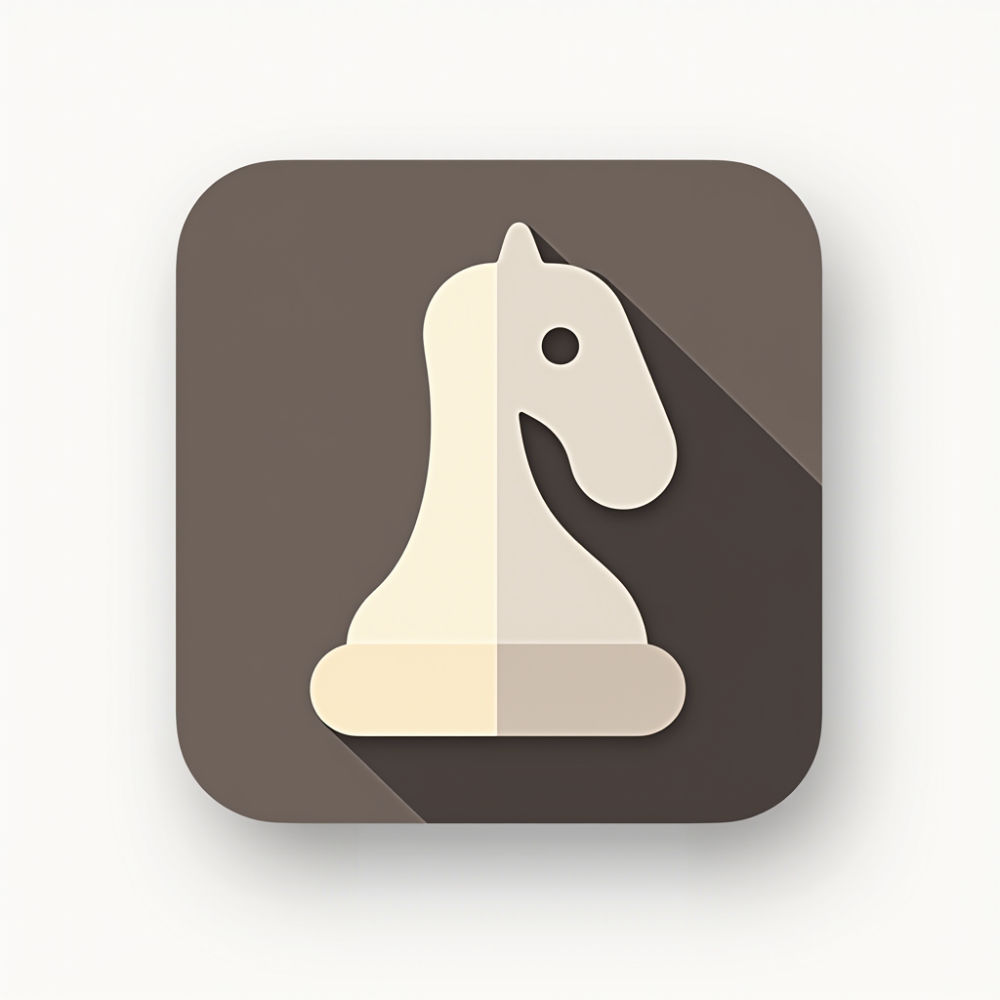

# Chess App

  

A comprehensive chess analysis and study application built for macOS using SwiftUI. This app provides a modern, native interface for analyzing chess games, studying openings, and managing your chess database with advanced features designed for serious chess players and analysts.

## Features

### Current Implementation
- **Multi-Game Tab Interface**: Safari-style tabs for managing multiple open games simultaneously
- **PGN Import/Export**: Full support for Portable Game Notation with parsing and validation
- **Game Database**: Local Core Data storage with search, filtering, and organization capabilities
- **Interactive Chess Board**: Resizable board with piece movement visualization and position navigation
- **Opening Detection**: Basic opening identification and move sequence analysis
- **Game Analysis Navigation**: Move-by-move playback with position history
- **Cross-Platform Assets**: High-quality SVG chess piece graphics for crisp rendering

### User Interface
- **Native macOS Design**: Clean, modern interface following Apple's design guidelines
- **Full-Height Sidebar**: Organized navigation with main features and recent games
- **Responsive Layout**: Adaptive interface that works across different screen sizes
- **Tab Management**: Easy switching between games with visual feedback and close functionality

## Installation

1. Clone the repository
2. Open `Chess.xcodeproj` in Xcode
3. Build and run on macOS 13.0 or later

## Usage

1. **Import Games**: Use the database view to import PGN files or add games manually
2. **Open Games**: Click on any game to open it in a new tab
3. **Navigate Positions**: Use the Previous/Next buttons to move through game positions
4. **Switch Games**: Click between tabs to analyze multiple games simultaneously
5. **Save Analysis**: Use the Save Game button to store games in your local database

## Todo List

### Engine Implementation
- [ ] **Stockfish Integration**: Implement Stockfish engine for position evaluation and analysis
  - [ ] Engine installation and setup for macOS
  - [ ] Real-time position evaluation display
  - [ ] Best move suggestions and analysis depth control
  - [ ] Multi-PV analysis for showing multiple best continuations

- [ ] **Leela Chess Zero (LC0) Support**: Add neural network-based engine analysis
  - [ ] LC0 integration with proper network weights
  - [ ] GPU acceleration support for faster analysis
  - [ ] WDL (Win/Draw/Loss) probability display
  - [ ] Policy network move suggestions

### Interactive Analysis Features
- [ ] **Arrow Drawing System**: Visual annotation tools for position analysis
  - [ ] Click and drag to draw arrows on the board
  - [ ] Different arrow colors for various types of analysis
  - [ ] Square highlighting and marking system
  - [ ] Save annotations with game positions

- [ ] **Move Addition and Analysis**: Extend games with analysis and variations
  - [ ] Add new moves to existing games
  - [ ] Create and manage variation trees
  - [ ] Annotate positions with text comments
  - [ ] Engine evaluation integration with move suggestions
  - [ ] Save enhanced games with analysis back to database

### Opening Study System
- [ ] **Spaced Repetition Opening Lines**: Intelligent opening training system
  - [ ] Create and manage opening repertoires
  - [ ] Spaced repetition algorithm for optimal learning
  - [ ] Track progress and success rates for different lines
  - [ ] Quiz mode for testing opening knowledge
  - [ ] Import opening books and master games

- [ ] **Advanced Opening Explorer**: Comprehensive opening database
  - [ ] Large master game database integration
  - [ ] Statistical analysis of opening positions
  - [ ] Transposition detection and handling
  - [ ] Opening trend analysis and popularity metrics
  - [ ] ECO (Encyclopedia of Chess Openings) classification

### Enhanced Database Features
- [ ] **Advanced Search and Filtering**: Sophisticated game discovery tools
  - [ ] Search by tactical motifs (opposite side castling, rook lifts, etc.)
  - [ ] Pattern recognition for common sacrifices and tactics
  - [ ] Player style analysis and comparison
  - [ ] Time control and tournament filtering
  - [ ] Endgame pattern search

- [ ] **Tactical Motif Recognition**: Automated pattern detection
  - [ ] Rook sacrifice identification
  - [ ] Piece sacrifice patterns
  - [ ] Pawn structure analysis
  - [ ] King safety evaluation
  - [ ] Tactical theme categorization

### Import and Export Features
- [ ] **Screenshot to Game Import**: Advanced image recognition
  - [ ] Board position recognition from screenshots
  - [ ] FEN generation from board images
  - [ ] OCR for move notation in images
  - [ ] Batch processing for multiple images
  - [ ] Integration with popular chess websites

- [ ] **Enhanced Export Options**: Multiple format support
  - [ ] LaTeX export for academic papers
  - [ ] HTML export with interactive boards
  - [ ] PDF generation with diagrams
  - [ ] ChessBase format compatibility
  - [ ] lichess.org and chess.com integration

### Additional Features
- [ ] **Endgame Tablebase Integration**: Perfect endgame analysis
- [ ] **Tournament Management**: Organize and track chess tournaments
- [ ] **Training Puzzles**: Tactical puzzle solving with progress tracking
- [ ] **Cloud Synchronization**: Backup and sync across devices
- [ ] **Printing Support**: Print games and positions with proper formatting
- [ ] **Accessibility Features**: VoiceOver support and keyboard navigation

## Contributing

Contributions are welcome! Please feel free to submit pull requests or open issues for bugs and feature requests.

## License

This project is licensed under the MIT License - see the LICENSE file for details.

## Acknowledgments

- Chess piece graphics adapted from open-source chess sets
- PGN parsing implementation follows standard PGN specification
- Built with SwiftUI and Core Data for native macOS performance
